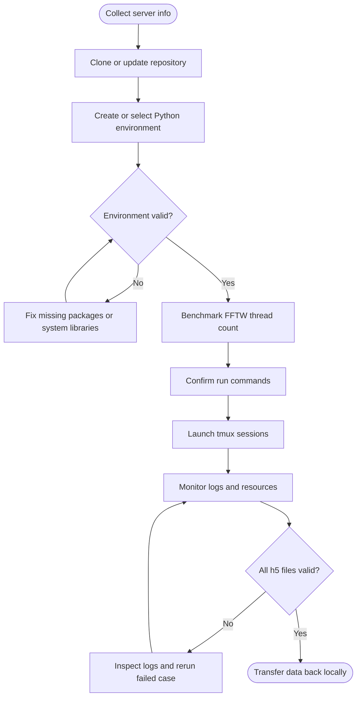

# 04 bursting experiment server run plan

_在服务器上运行 `04_run_bursting.py` 的准备、执行、监控和数据回传计划。本文档只描述计划，不在本地执行模拟。_

---

## 目标

本轮服务器计算用于生成 bursting regime 的长时间稳定性数据，并比较以下十组模拟：

- mrSAV 固定步长，`tau = 0.001`
- mrSAV 固定步长，`tau = 0.0005`
- IMEX 固定步长，`tau = 0.001`
- IMEX 固定步长，`tau = 0.0005`
- ETD 固定步长，`tau = 0.001`
- ETD 固定步长，`tau = 0.0005`
- ETD 固定步长，`tau = 0.0001`
- IMEX 固定步长，`tau = 0.0001`
- mrSAV 固定步长，`tau = 0.0001`
- mrSAV 自适应步长

主要输出为 `data/*.h5` 文件，后续在本地 notebook 中进行统计分析、图表生成和论文表格更新。

## 服务器信息

执行前先补齐以下信息，避免中途发现环境、磁盘或权限问题。

| 项目 | 内容 |
| --- | --- |
| 服务器地址 | `hpceias.eitech.edu.cn` |
| 登录用户 | `root` |
| SSH 命令 | `ssh -p 40193 -i ~/.ssh/id_rsa root@hpceias.eitech.edu.cn` |
| 项目目录 | `~/ETD-mr-SAV-MS2` |
| 数据回传目标 | 本地 `./data/` |

## 总体流程



## 1. 克隆或更新项目

如果服务器上还没有项目：

```bash
git clone https://github.com/HaifengWang1031/ETD-mr-SAV-MS2.git
cd ETD-mr-SAV-MS2
```

如果服务器上已有项目：

```bash
cd ~/ETD-mr-SAV-MS2
git status --short --branch
git pull --ff-only
```

执行前记录当前提交号，方便后续追溯：

```bash
git rev-parse --short HEAD
```

## 2. 建立或选择运行环境

优先使用 `conda-forge` 安装 `pyfftw`，这样 FFTW 库和 Python 绑定版本更容易保持一致。

```bash
conda create -n etd-mrsav-ms2 -c conda-forge \
  python=3.11 numpy scipy h5py matplotlib tqdm pyfftw ipykernel

conda activate etd-mrsav-ms2
```

如果服务器已有合适环境，则只需激活并验证：

```bash
conda activate etd-mrsav-ms2
python - <<'PY'
import numpy
import scipy
import h5py
import pyfftw

print("numpy", numpy.__version__)
print("scipy", scipy.__version__)
print("h5py", h5py.__version__)
print("pyfftw", pyfftw.__version__)
PY
```

运行脚本帮助信息，确认参数名和默认值：

```bash
python 04_run_bursting.py --help
```

## 3. 运行前代码核对

执行前确认以下几点：

- `04_run_bursting.py` 的默认参数符合本轮实验：`Re = 40`、`m = 4`、`eps = 3`、`gamma = 1000`
- 固定步长输出路径格式为 `data/ns_{M}_bursting_{Re}_{m}_{eps}_{tau}.h5`
- 自适应步长输出路径格式为 `data/ns_{M}_bursting_{Re}_{m}_{eps}_vs.h5`
- `vs_ns_periodic_mrSAV_solver.py` 支持 `M = "IMEX"`、`M = "ETD"` 和 `M = "ETD_mrGSAV_MS2_b"`
- `data/` 和 `logs/` 目录存在

建议先创建输出目录：

```bash
mkdir -p data logs
```

## 4. 测试最佳 FFTW 线程数

当前求解器会在初始化时设置：

```python
pyfftw.config.NUM_THREADS = _optimal_fftw_threads(max(discrete_num))
```

服务器上需要先测试最佳线程数，再决定是否调整 `vs_ns_periodic_mrSAV_solver.py` 中 `_optimal_fftw_threads` 的策略。

### 测试原则

- 单进程测试：找出单个模拟最快的 FFTW 线程数
- 多进程测试：考虑五个 tmux 会话同时运行时的总 CPU 占用
- 如果五组模拟同时跑，单个进程的 FFTW 线程数不宜过高，否则会线程过度竞争

### 建议测试点

| 测试项 | 建议值 |
| --- | --- |
| 单进程 FFTW 线程数 | `1, 2, 4, 8, 16` |
| 同时运行任务数 | `1` 和 `5` |
| 测试时长 | 每组短时间试跑，例如 `t = 10` 或 `t = 50` |
| 记录指标 | wall time、CPU 占用、内存峰值、是否出现 swap |

### 记录模板

| FFTW 线程数 | 同时任务数 | wall time | CPU 使用 | 内存峰值 | 结论 |
| --- | ---: | ---: | ---: | ---: | --- |
| `1` | `1` | `TODO` | `TODO` | `TODO` | `TODO` |
| `2` | `1` | `TODO` | `TODO` | `TODO` | `TODO` |
| `4` | `1` | `TODO` | `TODO` | `TODO` | `TODO` |
| `8` | `1` | `TODO` | `TODO` | `TODO` | `TODO` |
| `16` | `1` | `TODO` | `TODO` | `TODO` | `TODO` |
| `1` | `5` | `TODO` | `TODO` | `TODO` | `TODO` |
| `2` | `5` | `TODO` | `TODO` | `TODO` | `TODO` |
| `4` | `5` | `TODO` | `TODO` | `TODO` | `TODO` |

最终选择：

```text
最佳 FFTW 线程数: TODO
选择理由: TODO
是否需要修改 vs_ns_periodic_mrSAV_solver.py: TODO
```

## 5. 确认模拟命令

正式运行前确认 `--M "IMEX"` 和 `--M "ETD"` 是服务器当前代码支持的方法名。当前计划命令如下：

```bash
python 04_run_bursting.py --mode "fix" --tau 0.001
python 04_run_bursting.py --mode "fix" --tau 0.0005
python 04_run_bursting.py --mode "fix" --tau 0.001 --M "IMEX"
python 04_run_bursting.py --mode "fix" --tau 0.0005 --M "IMEX"
python 04_run_bursting.py --mode "fix" --tau 0.001 --M "ETD"
python 04_run_bursting.py --mode "fix" --tau 0.0005 --M "ETD"
python 04_run_bursting.py --mode "fix" --tau 0.0001 --M "ETD"
python 04_run_bursting.py --mode "fix" --tau 0.0001 --M "IMEX"
python 04_run_bursting.py --mode "fix" --tau 0.0001
python 04_run_bursting.py --mode "adaptive"
```

对应预期输出：

| 任务 | 预期输出 |
| --- | --- |
| mrSAV fixed `tau = 0.001` | `data/ns_ETD_mrGSAV_MS2_b_bursting_40_4_3_0.001.h5` |
| mrSAV fixed `tau = 0.0005` | `data/ns_ETD_mrGSAV_MS2_b_bursting_40_4_3_0.0005.h5` |
| IMEX fixed `tau = 0.001` | `data/ns_IMEX_bursting_40_4_3_0.001.h5` |
| IMEX fixed `tau = 0.0005` | `data/ns_IMEX_bursting_40_4_3_0.0005.h5` |
| ETD fixed `tau = 0.001` | `data/ns_ETD_bursting_40_4_3_0.001.h5` |
| ETD fixed `tau = 0.0005` | `data/ns_ETD_bursting_40_4_3_0.0005.h5` |
| ETD fixed `tau = 0.0001` | `data/ns_ETD_bursting_40_4_3_0.0001.h5` |
| IMEX fixed `tau = 0.0001` | `data/ns_IMEX_bursting_40_4_3_0.0001.h5` |
| mrSAV fixed `tau = 0.0001` | `data/ns_ETD_mrGSAV_MS2_b_bursting_40_4_3_0.0001.h5` |
| mrSAV adaptive | `data/ns_ETD_mrGSAV_MS2_b_bursting_40_4_3_vs.h5` |

## 6. 使用 tmux 并行运行

建议每个任务一个独立 tmux 会话，日志写入 `logs/`。这样 SSH 断开后任务仍会继续。

```bash
tmux new -s burst_fix_1e3
conda activate etd-mrsav-ms2
python 04_run_bursting.py --mode "fix" --tau 0.001 2>&1 | tee logs/burst_fix_1e3.log
```

```bash
tmux new -s burst_fix_5e4
conda activate etd-mrsav-ms2
python 04_run_bursting.py --mode "fix" --tau 0.0005 2>&1 | tee logs/burst_fix_5e4.log
```

```bash
tmux new -s burst_imex_1e3
conda activate etd-mrsav-ms2
python 04_run_bursting.py --mode "fix" --tau 0.001 --M "IMEX" 2>&1 | tee logs/burst_imex_1e3.log
```

```bash
tmux new -s burst_imex_5e4
conda activate etd-mrsav-ms2
python 04_run_bursting.py --mode "fix" --tau 0.0005 --M "IMEX" 2>&1 | tee logs/burst_imex_5e4.log
```

```bash
tmux new -s burst_etd_1e3
conda activate etd-mrsav-ms2
python 04_run_bursting.py --mode "fix" --tau 0.001 --M "ETD" 2>&1 | tee logs/burst_etd_1e3.log
```

```bash
tmux new -s burst_etd_5e4
conda activate etd-mrsav-ms2
python 04_run_bursting.py --mode "fix" --tau 0.0005 --M "ETD" 2>&1 | tee logs/burst_etd_5e4.log
```

```bash
tmux new -s burst_etd_1e4
conda activate etd-mrsav-ms2
python 04_run_bursting.py --mode "fix" --tau 0.0001 --M "ETD" 2>&1 | tee logs/burst_etd_1e4.log
```

```bash
tmux new -s burst_imex_1e4
conda activate etd-mrsav-ms2
python 04_run_bursting.py --mode "fix" --tau 0.0001 --M "IMEX" 2>&1 | tee logs/burst_imex_1e4.log
```

```bash
tmux new -s burst_fix_1e4
conda activate etd-mrsav-ms2
python 04_run_bursting.py --mode "fix" --tau 0.0001 2>&1 | tee logs/burst_fix_1e4.log
```

```bash
tmux new -s burst_adaptive
conda activate etd-mrsav-ms2
python 04_run_bursting.py --mode "adaptive" 2>&1 | tee logs/burst_adaptive.log
```

`tau = 0.0001` 的任务步数为 `1e8`，日志如果逐步写入会非常大。正式服务器运行时可使用降采样日志包装器，只保留约每 60 秒一次的进度、起止信息和异常信息，避免 `logs/` 目录膨胀到数十 GB。

常用 tmux 操作：

| 操作 | 命令 |
| --- | --- |
| 查看会话 | `tmux ls` |
| 进入会话 | `tmux attach -t burst_fix_1e3` |
| 退出但不终止 | `Ctrl-b d` |
| 结束会话 | `tmux kill-session -t burst_fix_1e3` |

## 7. 运行期间监控

建议定期检查：

```bash
tmux ls
tail -n 40 logs/burst_adaptive.log
du -sh data logs
df -h .
```

资源监控可使用服务器已有工具：

```bash
top
htop
free -h
```

如果发现某个任务失败，先保存对应日志，不要覆盖原始 `.h5` 文件。重跑时建议把旧文件改名：

```bash
mv data/FAILED_FILE.h5 data/FAILED_FILE.failed.h5
```

## 8. 完成后检查输出完整性

所有任务结束后，先检查文件是否存在：

```bash
ls -lh data/*bursting_40_4_3*.h5
```

再用只读方式检查 HDF5 结构和关键数据集：

```bash
python - <<'PY'
from pathlib import Path
import h5py

required = [
    "Omega",
    "tn_s",
    "q",
    "tn",
    "Mx",
    "Energy",
    "Enstrophy",
    "Palinstrophy",
    "CPU_time",
]

for path in sorted(Path("data").glob("*bursting_40_4_3*.h5")):
    with h5py.File(path, "r") as f:
        missing = [name for name in required if name not in f]
        mode = f.attrs.get("mode", "UNKNOWN")
        method = f.attrs.get("method", "UNKNOWN")
        t_period = f.attrs.get("t_period", "UNKNOWN")
        tn_last = f["tn"][-1] if "tn" in f and len(f["tn"]) else "EMPTY"
        print(path.name)
        print("  mode:", mode, "method:", method, "t_period:", t_period, "tn_last:", tn_last)
        print("  missing:", missing if missing else "none")
PY
```

验收标准：

- 十个 `.h5` 文件均存在
- 每个文件都包含关键数据集
- `tn` 最后时间应到达 `10000`
- adaptive 文件额外包含 `tau`
- 日志中没有 traceback、NaN 或提前终止信息

## 9. 数据回传到本地

服务器当前没有 `rsync` 时，从本地机器执行 `scp`，将新增结果同步回来：

```bash
scp -P 40193 -i ~/.ssh/id_rsa \
  root@hpceias.eitech.edu.cn:'~/ETD-mr-SAV-MS2/data/ns_ETD_bursting_40_4_3_0.001.h5 ~/ETD-mr-SAV-MS2/data/ns_ETD_bursting_40_4_3_0.0005.h5 ~/ETD-mr-SAV-MS2/data/ns_ETD_bursting_40_4_3_0.0001.h5 ~/ETD-mr-SAV-MS2/data/ns_IMEX_bursting_40_4_3_0.0001.h5 ~/ETD-mr-SAV-MS2/data/ns_ETD_mrGSAV_MS2_b_bursting_40_4_3_0.0001.h5' \
  ./data/

scp -P 40193 -i ~/.ssh/id_rsa \
  root@hpceias.eitech.edu.cn:'~/ETD-mr-SAV-MS2/logs/burst_etd_1e3.log ~/ETD-mr-SAV-MS2/logs/burst_etd_5e4.log ~/ETD-mr-SAV-MS2/logs/burst_etd_1e4.log ~/ETD-mr-SAV-MS2/logs/burst_imex_1e4.log ~/ETD-mr-SAV-MS2/logs/burst_fix_1e4.log' \
  ./logs/
```

如果只想先传结果数据：

```bash
scp -P 40193 -i ~/.ssh/id_rsa \
  root@hpceias.eitech.edu.cn:'~/ETD-mr-SAV-MS2/data/ns_ETD_bursting_40_4_3_0.001.h5 ~/ETD-mr-SAV-MS2/data/ns_ETD_bursting_40_4_3_0.0005.h5 ~/ETD-mr-SAV-MS2/data/ns_ETD_bursting_40_4_3_0.0001.h5 ~/ETD-mr-SAV-MS2/data/ns_IMEX_bursting_40_4_3_0.0001.h5 ~/ETD-mr-SAV-MS2/data/ns_ETD_mrGSAV_MS2_b_bursting_40_4_3_0.0001.h5' \
  ./data/
```

## 10. 本地后续分析准备

数据回传后，再在本地进行分析，不在服务器上额外改动结果文件。

建议本地检查：

- 更新 `04_long_time_stability.ipynb` 或对应分析 notebook 的数据路径
- 对比 fixed `tau = 0.001`、fixed `tau = 0.0005`、adaptive 的长期统计量
- 对比 IMEX 与 mrSAV 的稳定性、能量统计和 burst 事件统计
- 重新生成论文所需图表和表格

## 待办清单

- [ ] 补齐服务器登录信息
- [ ] 克隆或更新服务器项目
- [ ] 建立并验证 Python 环境
- [ ] 创建 `data/` 和 `logs/` 目录
- [ ] 测试 FFTW 线程数
- [ ] 根据测试结果决定是否修改 `_optimal_fftw_threads`
- [ ] 确认十组命令和输出文件名
- [ ] 启动十个 tmux 会话或按新增批次启动剩余任务
- [ ] 监控日志、CPU、内存和磁盘
- [ ] 检查十个 `.h5` 文件完整性
- [ ] 将数据和日志回传本地
- [ ] 本地 notebook 重新分析并更新图表
